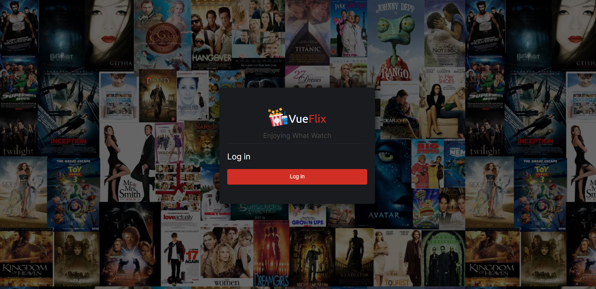
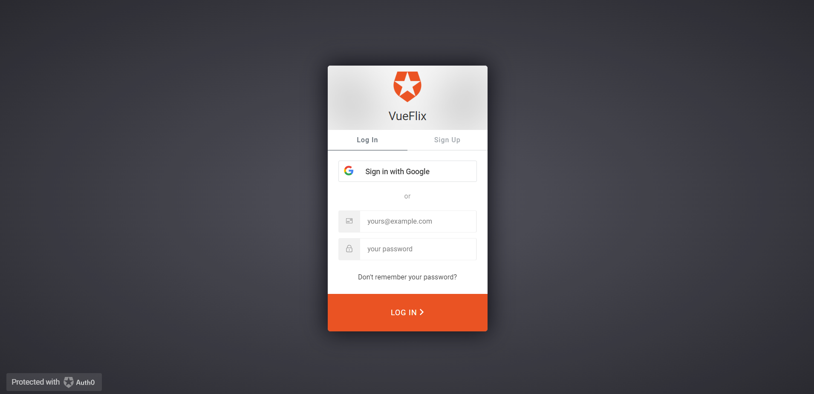
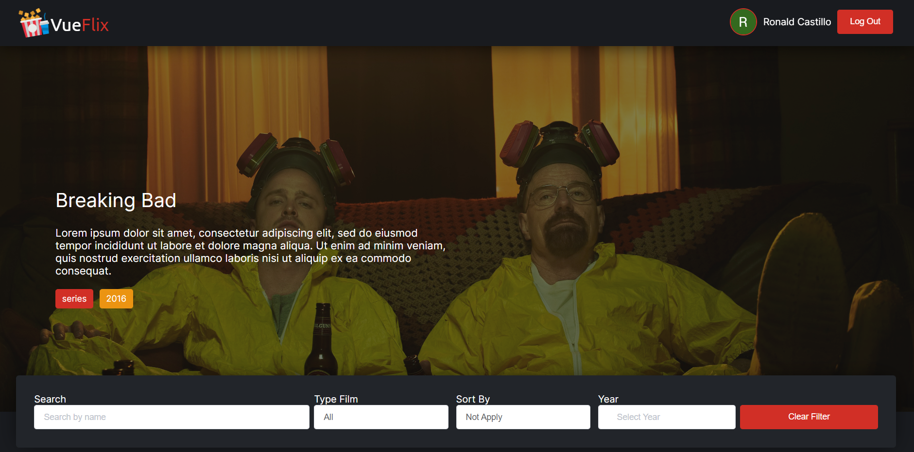
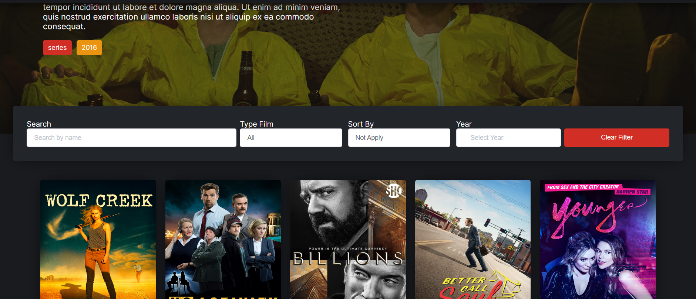
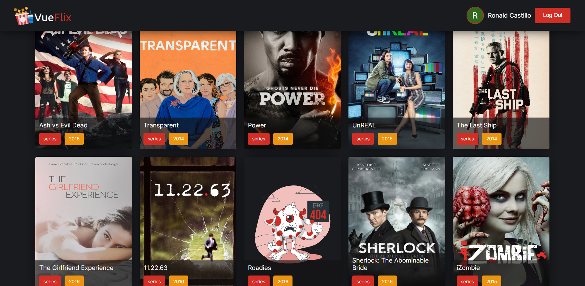
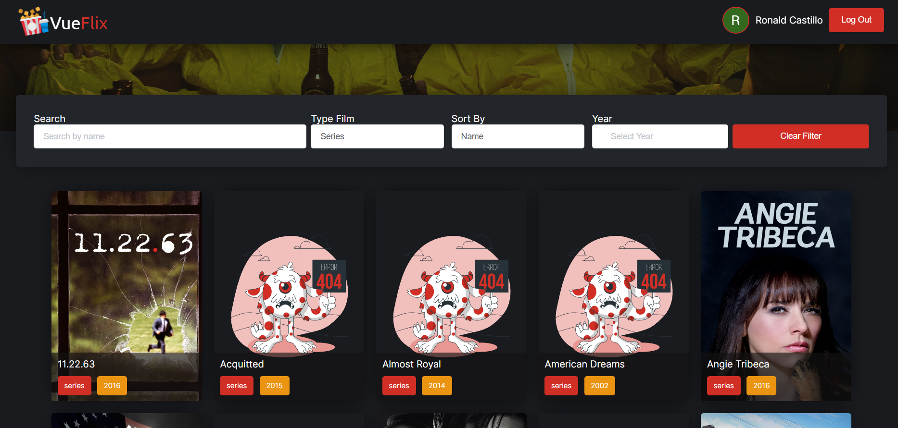
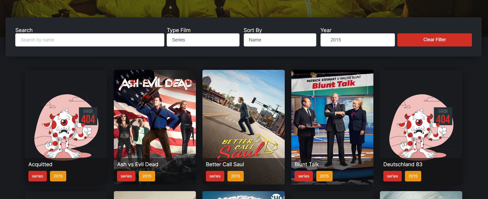

# Vueflix

Streaming Page where you can search movies and series

# Basic configuration 

## Recommended IDE Setup

[VSCode](https://code.visualstudio.com/) + [Volar](https://marketplace.visualstudio.com/items?itemName=Vue.volar) (and disable Vetur) + [TypeScript Vue Plugin (Volar)](https://marketplace.visualstudio.com/items?itemName=Vue.vscode-typescript-vue-plugin).

## Project Setup

```sh
npm install
```

### Compile and Hot-Reload for Development

```sh
npm run dev
```

### Run Unit Tests with [Vitest](https://vitest.dev/)

This project has some tests

```sh
npm run test:unit
```
# Steps for working app success

1. You must have an Auth0 (https://auth0.com/) account and put your credentials in the .env file. At the moment it has my credential. 

```sh

VITE_AUTH0_DOMAIN=[]
VITE_AUTH0_CLIENT_ID=[]
VITE_AUTH0_CALLBACK_URL=[]

```


# Design and flow

## Login 



## Auth0 Login 


## Home


#

#


## Differents filter 


#

